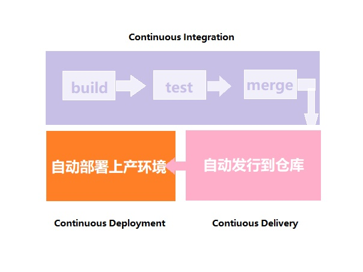
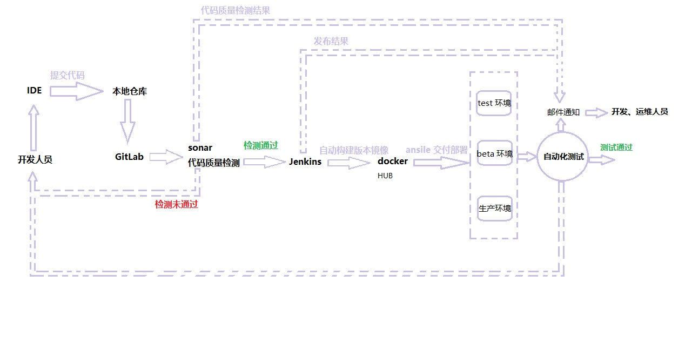
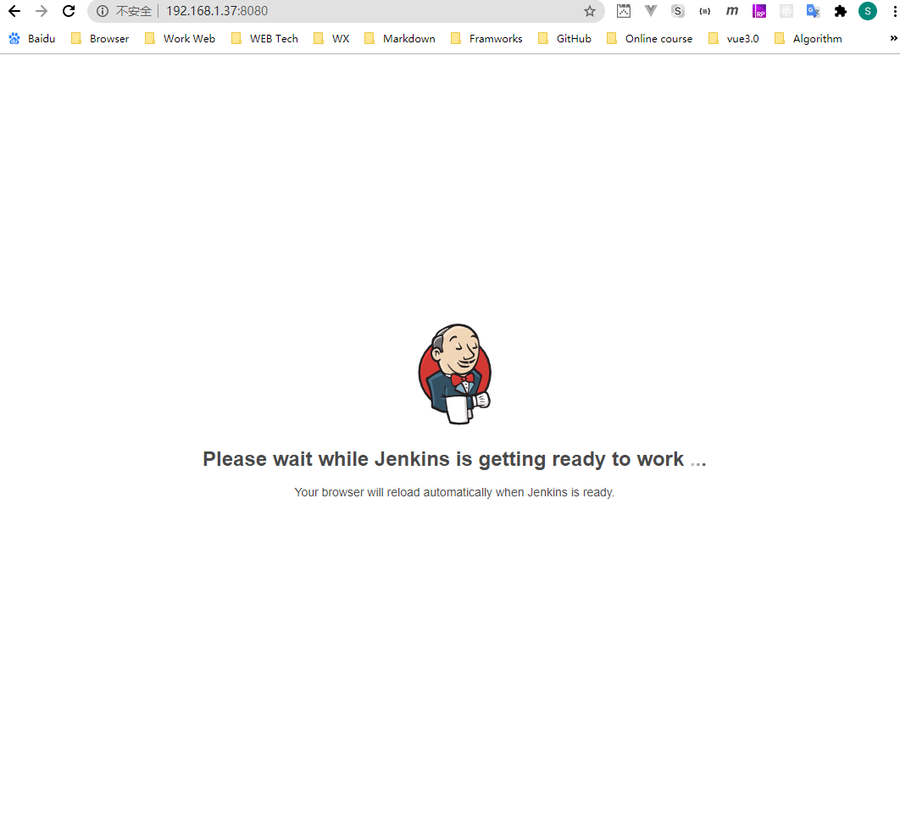
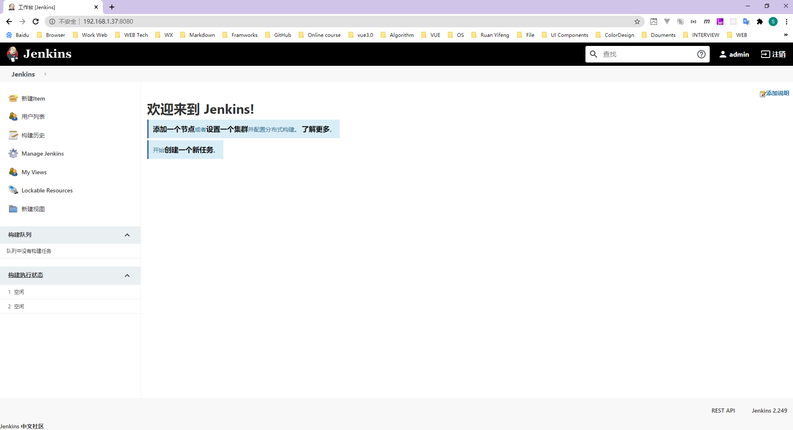
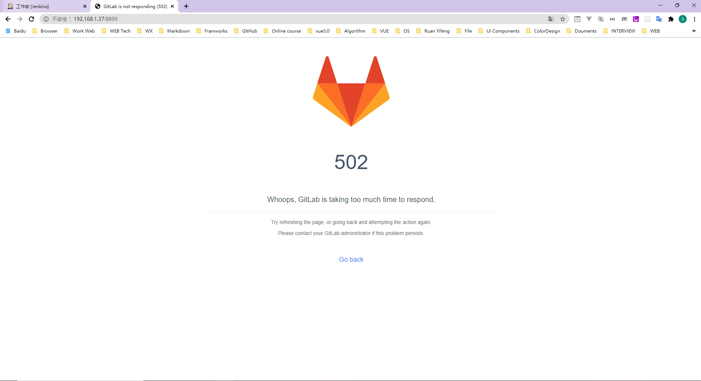
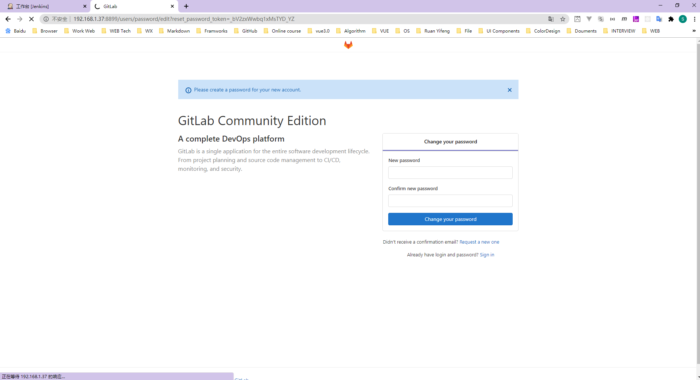
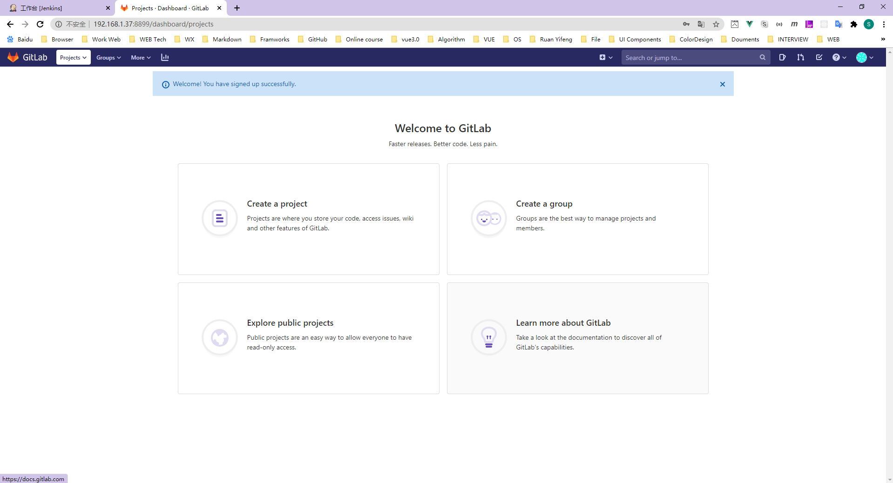

# CICD-Implement

This repository aims to implement CICD.

## Contents

* [CI & CD 简介](#CI&CD简介)
* [CI](#CI)
* [CD](#CD持续交付)
* [CD](#CD持续部署)
* [制品&制品库](#制品&制品库)
* [工作流图示](#工作流图示)
* [Docker](#Docker)
* [Jenkins](#Jenkins)
* [GitLab](#GitLab)
* [Nginx](#Nginx)

## CI&CD简介

* Continuous Integration 持续集成
* Continuous Deliver 持续交付
* Continuous Deployment 持续部署

CI/CD 是一种通过在应用开发阶段引入自动化来频繁向客户交付应用的方法。CI/CD 的核心概念是持续集成、持续交付和持续部署。涉及测试自动化、代码发布自动化

## CI

负责将上游代码库的代码拉取下来，执行用户预定义好的构建脚本，通过一系列编译操作(**BUILD**, **TEST**, **MERGE**)后，构建出一个**制品**，并推送到制品库。

常用工具：

* GitLab
* GitHub CI
* Jenkins

现代应用开发的目标是让多位开发人员同时处理同一应用的不同功能。但是，如果企业安排在一天内将所有分支源代码合并在一起（称为“合并日”），最终可能造成工作繁琐、耗时，而且需要手动完成。

持续集成（CI）可以帮助开发人员更加频繁地（有时甚至每天）将代码更改合并到共享分支或“主干”中。一旦开发人员对应用所做的更改被合并，系统就会通过自动构建应用并运行不同级别的自动化测试（通常是单元测试和集成测试）来验证这些更改，确保这些更改没有对应用造成破坏。

## CD持续交付

完成 CI 中构建及单元测试和集成测试的自动化流程后，持续交付可自动将已验证的代码发布到存储库。为了实现高效的持续交付流程，务必要确保 CI 已内置于开发管道。持续交付的目标是拥有一个可随时部署到生产环境的代码库。

在持续交付中，每个阶段（从代码更改的合并，到生产就绪型构建版本的交付）都涉及测试自动化和代码发布自动化。在流程结束时，运维团队可以快速、轻松地将应用部署到生产环境中。

## CD持续部署

负责从制品库红拉取最新制品，通过一些列部署工具，单个或批量执行命令对服务器进行部署。

常用工具：

* Ansible 

对于一个成熟的 CI/CD 管道来说，最后的阶段是持续部署。作为持续交付——自动将生产就绪型构建版本发布到代码存储库——的延伸，持续部署可以自动将应用发布到生产环境。由于在生产之前的管道阶段没有手动门控，因此持续部署在很大程度上都得依赖精心设计的测试自动化。

## 制品&制品库

* **制品**： 构建后的产物
* **制品库**：放置制品，做中转和版本管理

常用平台：

* Nexus
* Jfrog
* harbor 
* 其他对象存储平台

## 工作流图示




## Docker

### What

`docker` 是一个开源的应用容器引擎，开发者可以打包自己的应用到容器里面，然后迁移到其他机器的 docker 应用中，可以实现快速部署。如果出现的故障，可以通过镜像，快速恢复服务。

### 镜像

Docker镜像的概念有点像我们的 “代码模版”，镜像内是一个操作系统。

镜像一般都比较小，由多个层构成。我们可以看到，下图 Nginx 镜像最底层是 Ubuntu15.04 镜像，上层才是应用服务等其他层。在我们推送镜像/拉取镜像时，Docker不会拉取完整镜像，只会拉取有更改的那一层，这样可以做到快速更新镜像。例如下图是Nginx镜像的层级结构。

### 安装 Docker

```bash
# 安装依赖
yum install -y yum-utils device-mapper-persistent-data lvm2
# 阿里云源安装
sudo yum-config-manager --add-repo http://mirrors.aliyun.com/docker-ce/linux/centos/docker-ce.repo
yum install docker-ce
systemctl start docker
systemctl enable docker
docker -v

# 配置阿里云源
sudo mkdir -p /etc/docker
sudo tee /etc/docker/daemon.json <<-'EOF'
{
  "registry-mirrors": ["https://t7rll99r.mirror.aliyuncs.com"]
}
EOF
sudo systemctl daemon-reload
sudo systemctl restart docker
```

>Tip: device-mapper-persistent-data: 存储驱动，Linux上的许多高级卷管理技术 lvm: 逻辑卷管理器，用于创建逻辑磁盘分区使用


## Jenkins

### What

Jenkins 是一个基于Java语言开发的CI持续构建工具，主要用于持续、自动的构建/测试软件项目。
它可以执行你预先设定好的设置和脚本，也可以和 Git工具做集成，实现自动触发和定时触发器构建。

### 安装 

使用 Docker 安装 Jenkins 服务，在安装前，需要先安装 Docker 环境 :

安装防火墙

```bash
yum install firewalld systemd -y
service firewalld start
firewall-cmd --permanent --add-service=http
firewall-cmd --permanent --add-rich-rule="rule family="ipv4" source address="192.168.1.41/24" accept"
systemctl reload firewalld
```

使用 DockerFile 构建 Jenkins 镜像

```bash
vi Dockerfile

FROM jenkins/jenkins
USER root
# 清除了基础镜像设置的源，切换成阿里云源
RUN echo '' > /etc/apt/sources.list.d/jessie-backports.list \
  && echo "deb http://mirrors.aliyun.com/debian jessie main contrib non-free" > /etc/apt/sources.list \
  && echo "deb http://mirrors.aliyun.com/debian jessie-updates main contrib non-free" >> /etc/apt/sources.list \
  && echo "deb http://mirrors.aliyun.com/debian-security jessie/updates main contrib non-free" >> /etc/apt/sources.list
# 更新源并安装缺少的包
RUN apt-get update && apt-get install -y libltdl7
ARG dockerGid=999

RUN echo "docker:x:${dockerGid}:jenkins" >> /etc/group
```

### 构建 Jenkins

```bash
docker build -t local/jenkins .
```

> Tip:-t：镜像的名字及tag，通常name:tag或者name格式；可以在一次构建中为一个镜像设置多个tag

如果提示 Successfully tagged local/jenkins:latest 则构建成功

### 启动镜像

将Jenkins用户目录外挂到宿主机内，先新建一个 /home/jenkins 目录，并设置权限：

```bash
# 创建 Jenkins 工作目录
mkdir /home/jenkins
chown -R 1000 /home/jenkins/
```

接下来用镜像创建容器并启动：

```bash
docker run -itd --name jenkins -p 8080:8080 -p 50000:50000 \
-v /var/run/docker.sock:/var/run/docker.sock \
-v /usr/bin/docker:/usr/bin/docker \
-v /home/jenkins:/var/jenkins_home \
--restart always \
--user root local/jenkins
```

返回容器 ID 值：c2d3cc2ac626f95fca9281d8b5fb3262175434effe061deb27a813d444d3d90f

备注：
* -itd: 由 -i -t -d命令组合而成 
    * -i: 开启容器内的交互模式，允许用户可以进入容器进行输入交互 
    * -t: 分配一个虚拟终端 
    * -d: 允许容器以后台运行（不加的话只能前台运行，退出终端容器就停止了） 
* --name: 容器名称 
* -p: 将容器内的端口映射到宿主机的端口。格式为：宿主机端口:容器端口 
* -v: 将宿主机内的文件挂载到容器目录下。格式为：宿主机目录:容器目录 
* --user: 指定用户启动 
* --restart: 当 Docker 重启时，容器自动启动，否则就需要使用 docker restart 手动启动

### 查看 Jenkins 容器是否存在
```bash
docker ps
```

### 启动 Jenkins

首先我们在防火墙添加 8080 和 50000 端口的放行，并重载防火墙

```bash
firewall-cmd --zone=public --add-port=8080/tcp --permanent
firewall-cmd --zone=public --add-port=50000/tcp --permanent
systemctl reload firewalld
```

### 初始化 Jenkins 配置

Jenkins 启动完成后，会跳转至这个界面解锁 Jenkins。

Jenkins启动后，会生成一个 初始密码 ，该密码在 Jenkins 容器内存放，可以进入容器后查看密码内容。

```bash
docker exec -it jenkins /bin/bash
cat /var/jenkins_home/secrets/initialAdminPassword
exit;
```

备注：
* docker exec: 进入一个已启动的容器内，执行命令 
* cat：查看文件内容。如果逐步查看可以用 more 命令 
* -it: -i -t的组合 
    * -i: 即使没有附加也保持STDIN 打开 
    * -t: 分配一个伪终端

### 下载插件

解锁后，来到了插件下载页面。先进入容器配置一下清华大学的Jenkins插件源后，再安装插件。所以先不要点。

进入容器，查找 default.json  文件，把镜像源替换进去，替换后退出容器终端

```bash
docker exec -it jenkins /bin/bash
find / -name 'default.json'
sed -i 's/http:\/\/updates.jenkins-ci.org\/download/https:\/\/mirrors.tuna.tsinghua.edu.cn\/jenkins/g' /var/jenkins_home/updates/default.json && sed -i 's/http:\/\/www.google.com/https:\/\/www.baidu.com/g' /var/jenkins_home/updates/default.json
exit;
```

然后重启容器，重新访问界面，解锁后安装推荐插件

```bash
docker restart jenkins
```



### 安装完成

接下来一路按照提示配置，直到看到以下界面代表安装成功：




### 测试安装

我们点击 Jenkins 首页 -> 左侧导航 -> 新建任务 -> 构建一个自由风格的软件项目


## GitLab

### What

* 项目管理和代码托管平台
* 可通过 Web 界面进行访问公开的或者私人项目。

### 拉取 GitLab 镜像

这里拉取 gitlab-ce 社区版镜像

```bash
docker pull gitlab/gitlab-ce
```

### 创建 GitLab 容器

使用 docker CLI 启动一个新的 GitLab 容器

```bash
#创建 Gitlab 工作目录
mkdir /home/gitlab 

docker run -itd -p 443:443 \
-p 8899:8899 \
-p 333:333 \
--name gitlab \
--restart always \
-v /home/gitlab/config:/etc/gitlab \
-v /home/gitlab/logs:/var/log/gitlab \
-v /home/gitlab/data:/var/opt/gitlab \
gitlab/gitlab-ce
```

备注：
* --restart: 当 Docker 重启时，容器自动启动，否则就需要使用 docker restart 启动 
* gitlab端口映射规则：最好内外端口映射一致，gitlab 会根据你的配置文件调整服务端口。
* 如外部访问 8899，内外都配置 8899 一般 GitLab 有三个端口要使用：ssh，https，主服务地址。 ssh 默认是 22，这里我改为了 333，下方配置文件内也要改为 333

在防火墙添加 333 和 8899 端口的放行，并重载防火墙:

```bash
firewall-cmd --zone=public --add-port=333/tcp --permanent
firewall-cmd --zone=public --add-port=8899/tcp --permanent
systemctl reload firewalld
```

### 修改 GitLab 配置文件

容器启动后，我们需要修改 GitLab 配置文件，修改 GitLab 主服务地址和 SSH 服务地址

```bash
vi /home/gitlab/config/gitlab.rb
```

在文件内增加三条配置：

* external_url: 外部服务访问地址
* gitlab_rails['gitlab_ssh_host']：SSH 代码拉取地址
* gitlab_rails['gitlab_shell_ssh_port']：SSH 代码拉取端口    

```bash
external_url 'http://192.168.1.37:8899'
gitlab_rails['gitlab_ssh_host'] = '192.168.1.37'
gitlab_rails['gitlab_shell_ssh_port'] = SSH端口
```

如果修改SSH端口

SSH 默认的端口是 22 。这里内外分开，将 GitLab 容器内SSH端口改为了 333 。

先进入 GitLab 容器，直接编辑 /assets/sshd_config 和 /etc/ssh/sshd_config 这两个文件即可。修改最上方的 Port 字段。

```bash
docker exec -it gitlab /bin/bash
vim /assets/sshd_config
vim /etc/ssh/sshd_config
```

接着重启 GitLab

```bash
docker restart gitlab
```

### 启动 GitLab

访问 宿主机:端口 ，查看Gitlab启动情况，如果显示 502 ，则代表正在启动中。第一次启动时间可能会有些长。如显示以下界面，代表启动成功。



修改密码后，默认管理员是 admin ，登录进入即可



注册成功



## Nginx

### 安装

用docker安装即可：
```js
docker pull nginx
```

接着启动一个 Nginx 容器，将配置文件，资源文件，日志文件挂载到宿主机的 /home/nginx

```js
mkdir /home/nginx
docker run -itd -p 80:80 --name jenkins-test \
  -v /home/nginx/html:/usr/share/nginx/html \
  -v /home/nginx/logs:/var/log/nginx \
  --restart always \
  nginx
```
