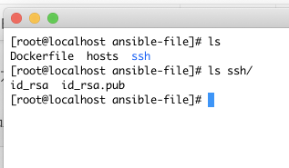
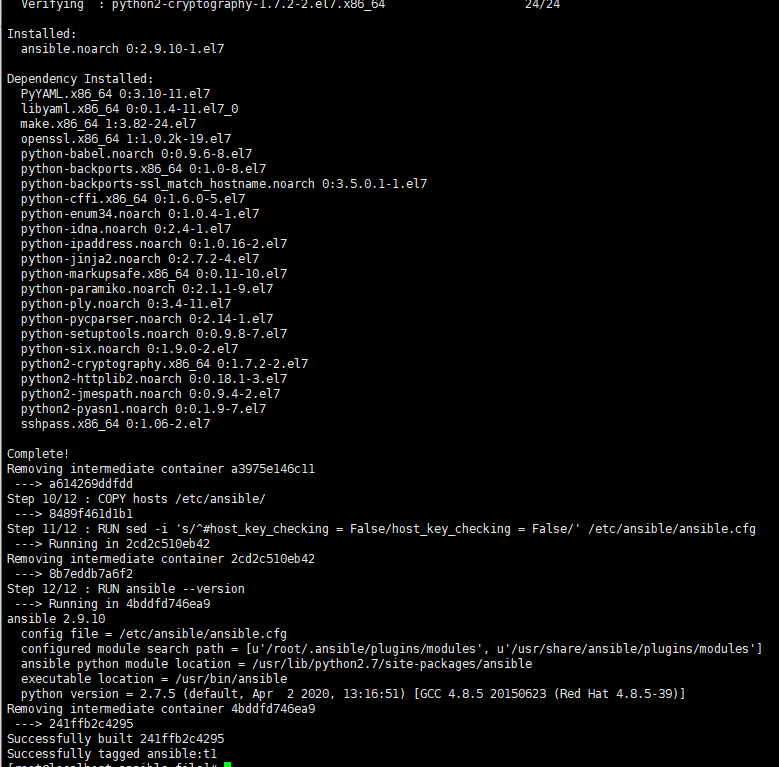
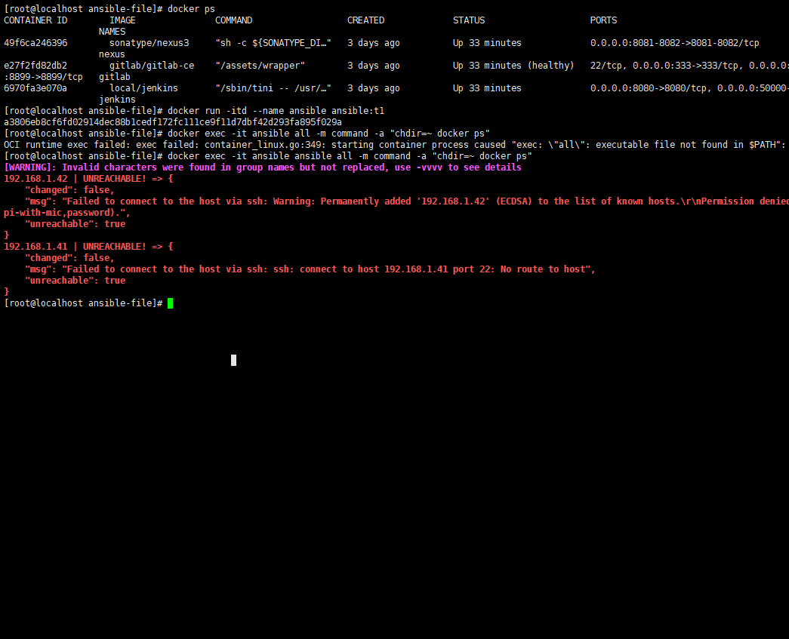

# Ansible 介绍与安装

## 啥是 Ansible

先看网络上对它的解释：

Ansible 是一款简单的运维自动化工具，只需要使用 ssh 协议连接就可以来进行**系统管理**，**自动化执行命令**，**部署**等任务。

显而易见， Ansible 拿来做服务器部署再合适不过。只需要:

预制好一份主机清单和要执行的命令步骤，就可以实现对一个**清单的全部或部分主机远程批量执行命令**。

## 对比 Jenkins

和 Jenkins 做服务部署对比， Ansible 更适合批量执行。

以前在 Jenkins 做部署，就是脚本执行 ssh 命令远程执行命令。如果有大量的服务器，那么的脚本会写很长，且灵活度会变差。

Ansible 还支持**无阻塞异步批量执行命令**，非常方便。

## 安装 Ansible

### 使用 Dockerfile 制作镜像

Ansible 目前的部署方式没有 Docker 安装，但可以定制一份 Ansible 镜像。

因为 Ansible 批量执行服务器时，还是采用的 ssh 进行操作，所以还是需要配置公钥私钥。可以找一个已经在目标服务器配置过的公钥，和它配套的私钥一起打到 Ansible镜像内。这样就可以实现 Ansible 免密登录

但是，ssh连接时还涉及到一个叫做 known_hosts 文件。这个文件的主要作用是：

当你用ssh连接到一个新的服务器的时候，ssh会让你确认服务器的信息（域名、IP、公钥），如果你确认了，就会将其写到 known_hosts 文件内。

以后你再连接到这个服务器，但是信息改变了（通常是公钥改变了），就会提示你服务器信息改变了，你可以把服务器信息它从 known_hosts 里删除，然后重新确认一份新的服务器信息。

但是在这里该文件作用不大，就可以在 Ansible 内配置 host_key_checking = False 来关闭这个校验（下方dockerfile内有写）。**直接使用公钥私钥配对成功就可以进行连接**。将公钥私钥放在 ssh 文件夹内即可：



除了公钥私钥外，还需要准备一份 **主机清单**，命名为 **hosts**。清单里面声明了要批量执行的主机。这里可以先简单写一下，下一章会详细描述清单的语法格式。最简单的格式使用中括号声明主机组名称，换行写 IP 即可。如下：

```bash
vim ./hosts
```

```json
[fs-servers]
192.168.1.42
192.168.1.41
```

这里使用 Centos7 做镜像底座，用 Dockerfile 做镜像：

```shell
FROM centos:7
# 安装必要依赖，openssh-clients是为了支持ssh连接
RUN yum -y install wget curl vim openssh-clients
RUN wget -O /etc/yum.repos.d/epel.repo http://mirrors.aliyun.com/repo/epel-7.repo
RUN yum clean all
RUN yum makecache
# 拷贝公钥私钥进镜像内
COPY ssh /root/.ssh/
# 公钥私钥赋权
RUN chmod 755 ~/.ssh/
RUN chmod 600 ~/.ssh/id_rsa ~/.ssh/id_rsa.pub
# 安装 ansible
RUN yum -y install ansible
# 拷贝主机组清单进 ansible 目录
COPY hosts /etc/ansible/
# 关闭 known_hosts 校验
RUN sed -i 's/^#host_key_checking = False/host_key_checking = False/' /etc/ansible/ansible.cfg
RUN ansible --version
```

使用 docker build 命令打包为镜像，版本为t1：
docker build -t ansible:t1 .

```bash
docker build -t ansible:t1 .
```


### 启动容器并测试

等待 build 完成后，使用 docker run 命令启动容器：

```bash
docker run -itd --name ansible ansible:t1
```

因为ansible并没有可视化界面，所以不需要分配端口

启动后，使用 docker exec + ansible command 命令测试 ansible 安装，并远程执行一个命令测试

```bash
docker exec -it ansible ansible all -m command -a "chdir=~ docker ps"
```



命令解释：
* ansible all: 代表匹配所有主机组的所有主机
* command：Ansible 命令模块。代表执行一个命令
* chdir=~：chdir 在哪里执行命令
* docker ps：查看正在跑的docker容器

执行成功后，如下图（我的主机组配置了 2 台机器，一台可以连接另一台不存在）：

到这里，我们的 Ansible 就安装成功