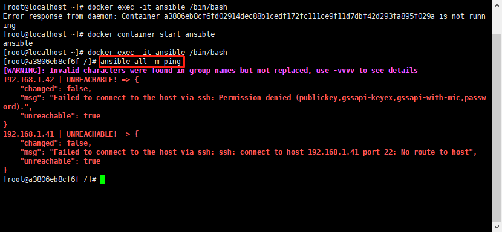
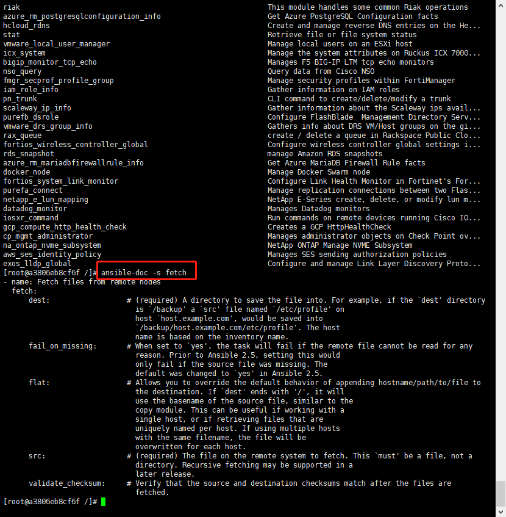
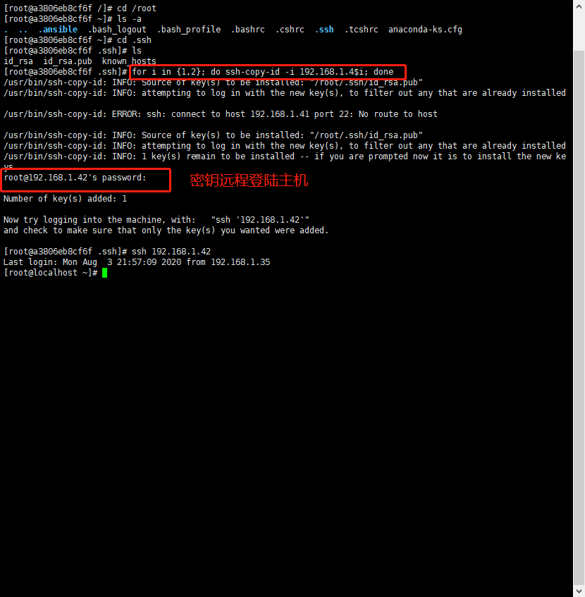
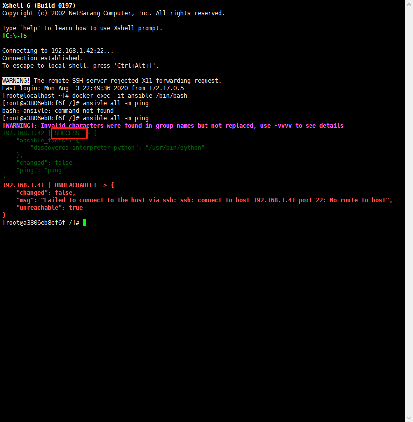
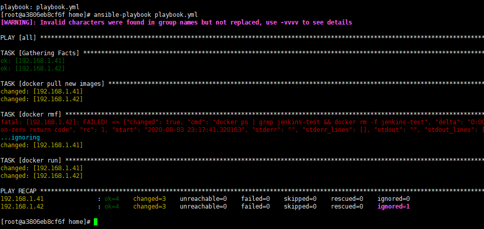
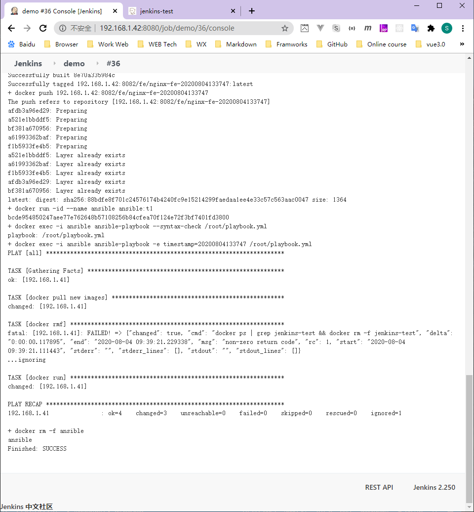

# Ansible 介绍与安装

## 啥是 Ansible

先看网络上对它的解释：

Ansible 是一款简单的运维自动化工具，只需要使用 ssh 协议连接就可以来进行**系统管理**，**自动化执行命令**，**部署**等任务。

显而易见， Ansible 拿来做服务器部署再合适不过。只需要:

预制好一份主机清单和要执行的命令步骤，就可以实现对一个**清单的全部或部分主机远程批量执行命令**。

## 对比 Jenkins

和 Jenkins 做服务部署对比， Ansible 更适合批量执行。

以前在 Jenkins 做部署，就是脚本执行 ssh 命令远程执行命令。如果有大量的服务器，那么的脚本会写很长，且灵活度会变差。

Ansible 还支持**无阻塞异步批量执行命令**，非常方便。

## 安装 Ansible

### 使用 Dockerfile 制作镜像

Ansible 目前的部署方式没有 Docker 安装，但可以定制一份 Ansible 镜像。

因为 Ansible 批量执行服务器时，还是采用的 ssh 进行操作，所以还是需要配置公钥私钥。可以找一个已经在目标服务器配置过的公钥，和它配套的私钥一起打到 Ansible镜像内。这样就可以实现 Ansible 免密登录

但是，ssh连接时还涉及到一个叫做 known_hosts 文件。这个文件的主要作用是：

当你用ssh连接到一个新的服务器的时候，ssh会让你确认服务器的信息（域名、IP、公钥），如果你确认了，就会将其写到 known_hosts 文件内。

以后你再连接到这个服务器，但是信息改变了（通常是公钥改变了），就会提示你服务器信息改变了，你可以把服务器信息它从 known_hosts 里删除，然后重新确认一份新的服务器信息。

但是在这里该文件作用不大，就可以在 Ansible 内配置 host_key_checking = False 来关闭这个校验（下方dockerfile内有写）。**直接使用公钥私钥配对成功就可以进行连接**。将公钥私钥放在 ssh 文件夹内即可：


除了公钥私钥外，还需要准备一份 **主机清单**，命名为 **hosts**。清单里面声明了要批量执行的主机。这里可以先简单写一下，下一章会详细描述清单的语法格式。最简单的格式使用中括号声明主机组名称，换行写 IP 即可。如下：

```bash
vim ./hosts
```

```json
[fs-servers]
192.168.1.42
192.168.1.41
```

这里使用 Centos7 做镜像底座，用 Dockerfile 做镜像：

```shell
FROM centos:7
# 安装必要依赖，openssh-clients是为了支持ssh连接
RUN yum -y install wget curl vim openssh-clients
RUN wget -O /etc/yum.repos.d/epel.repo http://mirrors.aliyun.com/repo/epel-7.repo
RUN yum clean all
RUN yum makecache
# 拷贝公钥私钥进镜像内
COPY ssh /root/.ssh/
# 公钥私钥赋权
RUN chmod 755 ~/.ssh/
RUN chmod 600 ~/.ssh/id_rsa ~/.ssh/id_rsa.pub
# 安装 ansible
RUN yum -y install ansible
# 拷贝主机组清单进 ansible 目录
COPY hosts /etc/ansible/
# 关闭 known_hosts 校验
RUN sed -i 's/^#host_key_checking = False/host_key_checking = False/' /etc/ansible/ansible.cfg
RUN ansible --version
```

使用 docker build 命令打包为镜像，版本为t1：
docker build -t ansible:t1 .

```bash
docker build -t ansible:t1 .
```


### 启动容器并测试

等待 build 完成后，使用 docker run 命令启动容器：

```bash
docker run -itd --name ansible ansible:t1
```

因为ansible并没有可视化界面，所以不需要分配端口

启动后，使用 docker exec + ansible command 命令测试 ansible 安装，并远程执行一个命令测试

```bash
docker exec -it ansible ansible all -m command -a "chdir=~ docker ps"
```


命令解释：
* ansible all: 代表匹配所有主机组的所有主机
* command：Ansible 命令模块。代表执行一个命令
* chdir=~：chdir 在哪里执行命令
* docker ps：查看正在跑的docker容器

执行成功后，如下图（我的主机组配置了 2 台机器，一台可以连接另一台不存在）：

到这里，的 Ansible 就安装成功

## Ansible 概念

### 基础命令

安装好 Ansible 后，使用 ansible 命令即可完成基础操作。例如以下命令可以测试你的所有主机的连通性：

```bash
ansible all -m ping
```

* -m 代表使用 ansible  某个模块，后紧跟模块名
* all 代表匹配所有主机组，这里也可以传入指定的主机组名称。



查看有哪些模块：
```bash
ansible-doc -l
```

查看模块的具体帮助，如 fetch 模块：

```bash
ansible-doc -s fetch
```



### Modules 模块

#### copy

文件拷贝模块：将 Ansible 主机下的目录拷贝到目标机器。例如将 Ansible 主机内的  /testdir/copytest 目录拷贝到目标机器 /opt 下。

```bash
ansible all -m copy "src=/testdir/copytest dest=/opt"
```

#### file

文件操作模块：可以对目标机器进行新建和删除文件。例如：

```bash
ansible all -m file -a "path=/testdir/testfile state=touch"
```
在目标机器下新建 /testdir/testfile 文件

```bash
ansible all -m file -a "path=/testdir/testfile state=absent"
```
在目标机器下删除 /testdir/testfile 文件

#### find

文件查找模块：可以查找目标机器内的文件。例如查找 /testdir 文件夹下包含 abc 字符串的文件：

```bash
ansible all -m find -a "path=/testdir contains='.*abc.*'"
```

#### replace

文件内容替换模块：可以在指定文件中通过正则匹配指定内容进行替换。例如在 /testdir/test 文件内，查找符合正则 abc 的内容，替换为 buck

```bash
ansible all -m replace -a "path=/testdir/test regexp='abc' replace=buck"
```

#### command

命令模块：可以在目标机器内执行命令。

> 注意：和 shell 命令不同的是，shell中的 < , > , | , ; , & , $ 等特殊字符不能在 command 模块中使用，如果需要使用，则用 shell 模块。

如：

```bash
ansible all -m command -a "chdir=/testdir ls"
```

在目标机器 /testdir 目录下执行 ls 命令

[详细参考](https://www.cnblogs.com/yanjieli/p/10969143.html)


### Inventory 主机清单

主机清单是 Ansible 最基础的概念，它声明了 Ansible 到底在哪些机器上执行命令。主机清单默认是 /etc/ansible/hosts 文件。

主机清单语法花样也很多。不仅可以**保存主机清单**，还可以**定义主机密码**，**授权方式**等其他信息。

一般在 Ansible 内，都是以 **组** 为集合管理主机。被称为 **主机组** ，一个主机组内有许多主机。

最简单的主机组声明：

```shell
[apache]
192.168.1.36
192.168.1.33
```

其中， apache 是主机组名，下面是组内的主机IP。

#### 使用密码连接

在主机组内，可以在清单内定义主机密码，端口等信息。

```bash
# 主机 + 端口 + 密码
# 方法一
[webserver]
192.168.1.31 ansible_ssh_port=22 ansible_ssh_user=root ansible_ssh_pass="123456"
192.168.1.32 ansible_ssh_port=22 ansible_ssh_user=root ansible_ssh_pass="123456"
192.168.1.33 ansible_ssh_port=22 ansible_ssh_user=root ansible_ssh_pass="123456"
192.168.1.36 ansible_ssh_port=22 ansible_ssh_user=root ansible_ssh_pass="123456"

# 方法二
[webserver]
192.168.1.3[1:3] ansible_ssh_user=root ansible_ssh_pass="123456"

# 方法三
[webserver]
192.168.1.3[1:3]
[webserver:vars]
ansible_ssh_pass="123456"
```

> 192.168.1.3[1:3]：代表 192.168.1.31 和 192.168.1.33

#### 使用密钥连接

当然，最常用的就是密钥连接服务器。这种情况下，只需要定义最简单的主机组，将 Ansible 机器公钥在目标机器配置即可。

1. 生成公司钥
    ```bash
    [root@ansible ~]# ssh-keygen
    [root@ansible ~]# for i in {1,2,3,6}; do ssh-copy-id -i 192.168.1.3$i ; done
    ```

2. 配置连接
    ```bash
    [root@ansible ~]# vim /etc/ansible/hosts
    # 方法一 主机 + 端口 + 密钥
    [webserver]
    192.168.1.31:22
    192.168.1.32
    192.168.1.33
    192.168.1.36

    # 方法一 别名主机 + 端口 + 密钥
    [webserver]
    node1 ansible_ssh_host=192.168.1.31 ansible_ssh_port=22
    node2 ansible_ssh_host=192.168.1.32 ansible_ssh_port=22
    node3 ansible_ssh_host=192.168.1.33 ansible_ssh_port=22
    node6 ansible_ssh_host=192.168.1.36 ansible_ssh_port=22
    ```



免密登陆，再次 ping 远程主机



[详细参考](https://www.cnblogs.com/yanjieli/p/10969089.html#380920160)

### Playbook 任务剧本

任务剧本（任务集），yaml 格式文件，定义 Ansible 任务的配置文件。作用有点像 Dockerfile。**是一组任务的集合声明文件**

示例：

```bash
---
- hosts: all
  remote_user: root
  vars:
    timestamp: 20200625233149
  tasks:
    - name: docker pull new images
      shell: 'chdir=~ docker pull 172.16.81.150:8082/fe/nginx-fe-{{timestamp}}'
    - name: docker rmf
      shell: 'chdir=~ docker ps | grep jenkins-test && docker rm -f jenkins-test'
      ignore_errors: true
    - name: docker run
      shell: 'chdir=~ docker run -p 80:80 -itd --name jenkins-test 172.16.81.150:8082/fe/nginx-fe-{{timestamp}}'
      
```



* hosts: 指定在哪个主机组执行该任务集合。 
* all 代表全部主机
* remote_user: 使用哪个用户进行远程执行
* vars: 定义变量的地方。在下方任务命令中可以使用 {{ varName }} 使用变量
* tasks: 任务集合
* shell: Ansible 的 shell 模块，上面有讲解模* 块的作用和类型。后面跟着模块的命令

[详细参考](https://www.cnblogs.com/yanjieli/p/10969299.html)

#### 执行 Playbook

可以使用 ansible-playbook 命令执行 playbook ：

```bash
ansible-playbook test.yml
```

使用 --syntax-check 命令测试 playbook 语法是否正确

```bash
ansible-playbook --syntax-check test.yml
```

测试 playbook 执行（并不会真的在主机组上执行，只是模拟）：

```bash
ansible-playbook --check test.yml
```

替换playbook中默认的变量值，并执行playbook。在这种情况下，命令行传入参数 > 默认值：

```bash
ansible-playbook -e "timestamp=212123323" test.yml
```

## 使用 Ansible 在多台机器部署制品

在部署之前，先将之前制作的测试 Ansible 镜像删除掉，重新制作一个新镜像。是用 docker rm 和 docker rmi 命令删除容器和镜像。

```bash
docker rm -f ansible
docker rmi -f ansible:t1
```

### 书写 Playbook

在上一张讲到， Playbook 是 Ansible 的任务集，是定义 Ansible 任务的配置文件。用 Ansible 批量执行多条任务，当然离不开 Playbook 。

playbook.yml 文件

```bash
vi playbook.yml
```

```bash
---
- hosts: all
  remote_user: root
  vars:
    timestamp: 20200625233149
  tasks:
    - name: docker pull new images
      shell: 'chdir=~ docker pull 192.168.1.42:8082/fe/nginx-fe-{{timestamp}}'
    - name: docker rmf
      shell: 'chdir=~ docker ps | grep jenkins-test && docker rm -f jenkins-test'
      ignore_errors: true
    - name: docker run
      shell: 'chdir=~ docker run -p 80:80 -itd --name jenkins-test 192.168.1.42:8082/fe/nginx-fe-{{timestamp}}'
```

> ignore_errors: 忽略错误继续执行

这里声明了三个任务:  拉取镜像 => 删除正在运行的 Nginx 容器 => 运行新镜像 。

同时修改 Dockerfile ，让其构建 Ansible 镜像时，也能将 playbook.yml 复制进去：

```bash
FROM centos:7
RUN yum -y install wget curl vim openssh-clients
RUN wget -O /etc/yum.repos.d/epel.repo http://mirrors.aliyun.com/repo/epel-7.repo
RUN yum clean all
RUN yum makecache
# 拷贝公钥私钥进镜像内
COPY ssh /root/.ssh/
# 公钥私钥赋权
RUN chmod 755 ~/.ssh/
RUN chmod 600 ~/.ssh/id_rsa ~/.ssh/id_rsa.pub
RUN yum -y install ansible
# 拷贝主机组进ansible目录
COPY hosts /etc/ansible/
# 关闭known_hosts校验
RUN sed -i 's/^#host_key_checking = False/host_key_checking = False/' /etc/ansible/ansible.cfg
RUN ansible --version
# 拷贝playbook进镜像内
COPY playbook.yml /root/
```

### 生成新镜像

使用 docker build 命令即可生成：

```bash
docker build -t ansible:t1 .
```

### 修改任务执行

替换 Jenkins 脚本内关于远程对制品库执行的命令：

```bash
set -e
timestamp=`date '+%Y%m%d%H%M%S'`

node -v
npm -v

npm install -g cnpm --registry=https://registry.npm.taobao.org

cnpm install

npm run build

(docker ps | grep ansible) && (docker rm -f ansible)

docker build -t 192.168.1.42:8082/fe/nginx-fe-$timestamp .
docker push 192.168.1.42:8082/fe-nginx-fe-$timestamp

docker run -id --name ansible ansible:t1

# check playbook syntax
docker exec -i ansible ansible-playbook --syntax-check /root/playbook.yml
# exec playbook
docker exec -i ansible ansible-playbook -e "timestamp=$timestamp" /root/playbook.yml

docker rm -f ansible
```

DONE



## BUG

* [WARNING]: Invalid characters were found in group names but not replaced, use
-vvvv to see details
  解决：将 hosts 文件中的 [服务名] 出现的 `-`去掉，如：fe-servers => servers