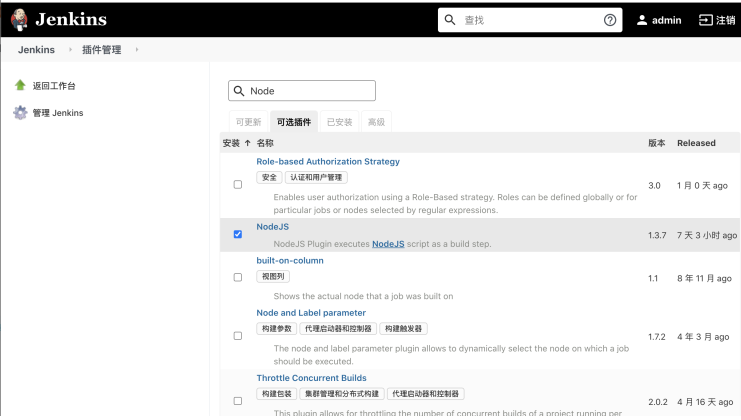
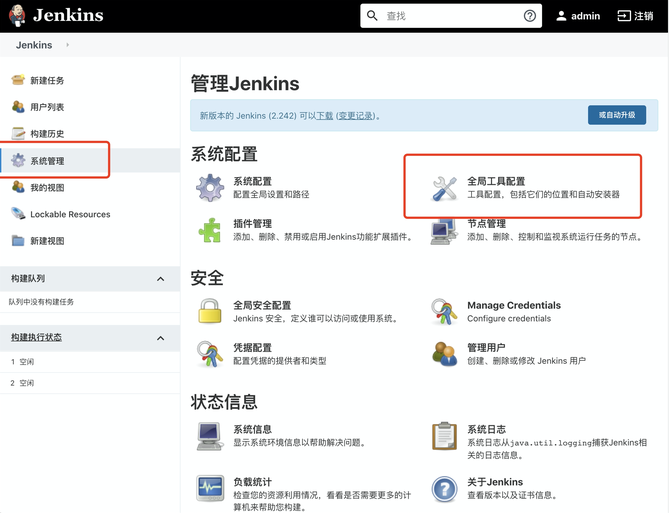
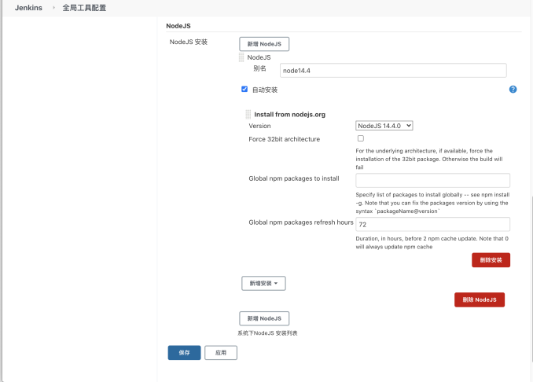
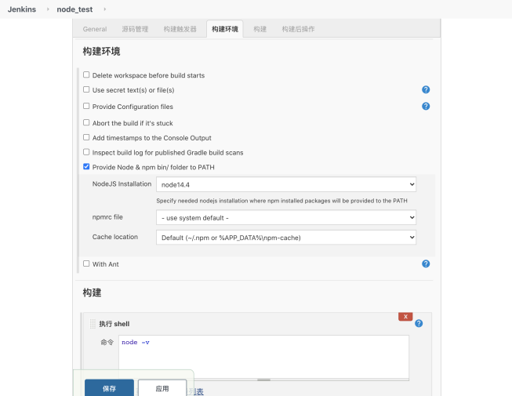
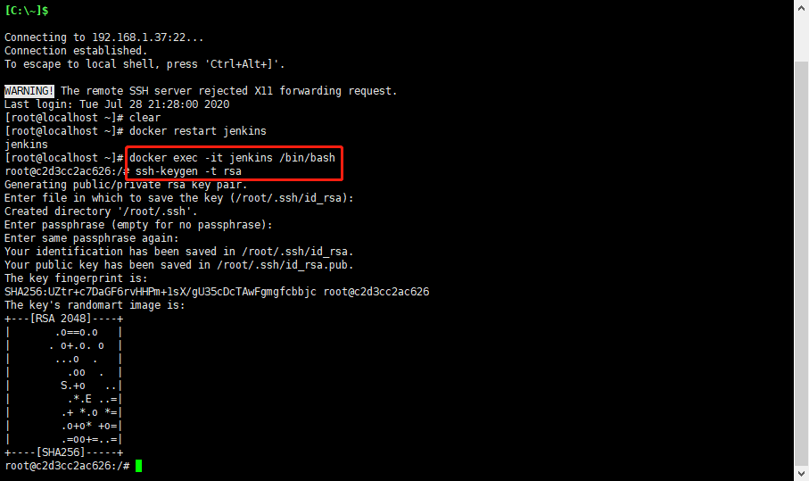
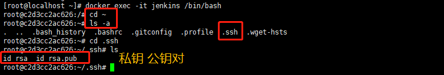
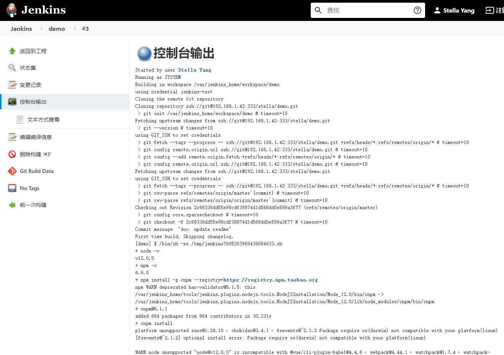
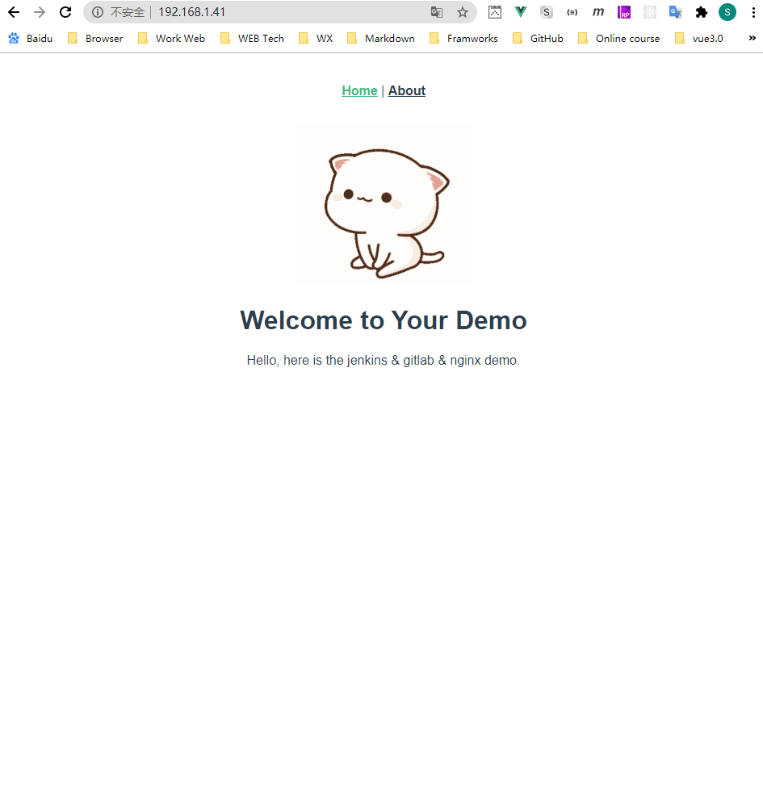
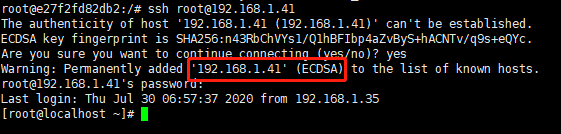

# Build Front-End with Jenkins & GitLab 

This passage aims to fulfill **CI** (Continuous Integration) and **CD** (Continuous Deploy), based on **Jenkins** and **GitLab**;

## Install Node.js With Jenkins

### Install

Jenkins 所在服务机器，是一个全新的容器环境，与外界隔离，以下是容器中安装 Node 方式：

* 进入 Jenkins 容器，手动安装 Node，靠谱但费时且需寻找缺失的依赖环境（Jenkins 容器底层是 Ubuntu）
* 类似 Docker in Docker, 将宿主机 Node 环境挂载到容器内，环境可能存在依赖缺失问题
* 使用 Jenkins 平台自带的工具安装 Node，方便省时可靠

steps:（第三种安装方式）

* 打开 Jenkins 首页
* 点击左侧 **系统配置**
* 选择 **插件管理**
* 点击 **可选插件**
* 搜索 **NodeJS**
* 左下角 **直接安装**



安装完毕，重启 Jenkins

```bash
docker restart jenkins
```

重启后：

* 选择左侧 **系统配置**
* 选择 **全局工具配置**
* 找到下面的 **Node.js**，点击新增安装，选择相应版本号填写信息即可。






### Usage

* 任务**配置**中
* 找到**构建环境**
* 选中 **Provide Node & npm bin/ folder to PATH**
* 选择刚配置好的 Node 即可
* 首次会下载 Node 版本，后续不会下载




## Start to CI

### Jenkins 容器端生成私钥公钥

先进入 Jenkins 容器内，使用 `ssh-keygen -t rsa` 生成私钥公钥

```js
docker exec -it jenkins /bin/bash
ssh-keygen -t rsa
exit;
```




执行后，我们生成的私钥公钥文件存放在了 **~/.ssh** 目录下。其中， **id_rsa** 为私钥， **id_rsa.pub** 为公钥。

### Jenkins 端配置私钥

* 在 Jenkins 端先配置刚才创建的私钥
* 在 GitLab 端配置公钥,用于代码拉取身份验证。
* 找到 Jenkins 首页的 **系统设置**，选择 **Manage Credentials**
* 点击下方 **全局**，点击左边的 **添加凭据**
* 选择类型为 **SSH Username with private key**

解析：

* ID 为此凭据在 Jenkins 的标示
* UserName 为你的 Gitlab 用户名
* PrivateKey 为你的服务器私钥
* 选择 PrivateKey，点击下方的 “add”，将服务器的私钥内容复制进去（记得上下方的提示英文也复制）。
* 保存退出

```bash
cat ~/.ssh/id_rsa
```

### GitLab 端配置公钥

打开 GitLab 页面，点击右上角头像 => 设置，找到左边的 “SSH密钥”。将 **~/.ssh/id_rsa.pub** 文件内容复制进去。点击添加密钥，保存成功

```bash
cat ~/.ssh/id_rsa.pub
```

### 配置任务

在上面，我们在分别配置了公钥和私钥用来做 SSH 免密登录。接下来我们的代码拉取，也用 SSH 的方式拉取。

新建一个任务，选择 **自由风格的软件项目**。创建完成后，找到 **源码管理**，点击 **Git**。

前往 GitLab 仓库地址，找到 **克隆**，复制 SSH 克隆地址。

将地址复制进刚才Jenkins任务 “Repository URL” 内，“Credentials” 选择刚才添加的凭证。

在下方找到 “构建”，选择 “执行Shell”。输入一段构建脚本来测试是否成功运行。

> 不要忘记勾选：Provide Node & npm bin/ folder to PATH，否则没有Node环境



## Start to CD

### 配置 Nginx 端公钥

上面我们讲到，使用Jenkins做自动化构建，但缺少部署一环。
我们新创建一个服务器，只存放一个 Nginx 服务。在这里，nginx的安装方式不限，可以用docker也可以直接安装。

我们在Nginx服务器内，使用 ssh-keygen -t rsa 生成公钥和私钥。接着 在 .ssh/authorized_keys 文件夹下，创建一个 authorized_keys 文件。将我们Jenkins容器端的公钥拷贝进 authorized_keys 文件内。

```bash
ssh-keygen -t rsa
cd .ssh/
touch authorized_keys
vi authorized_keys
```

### 修改 Jenkins 配置

编辑我们的 Jenkins 任务，新增加几条 shell 命令。

在我们 build 结束后，先将dist文件打包为压缩包，然后通过 linux scp 命令上传至Nginx服务器。接着用 ssh 命令远程操控解压到 Nginx 目录即可。

```bash
node -v
npm -v
npm install -g cnpm --registry=https://registry.npm.taobao.org
cnpm install
npm run build

# 压缩
tar -czvf vue-cli-demo.tar ./dist
scp ./vue-cli-demo.tar root@192.168.1.41:~
ssh root@192.168.1.41 "tar zxvf ~/vue-cli-demo.tar && mv dist/* /home/nginx/html"
```

> scp: 将本地文件/远程服务器内文件通过ssh上传/下载到指定地址

打开新机器的页面，如果访问成功代表部署成功。



## Terms

* scp: Secure Copy scp 是 linux 系统下基于 ssh 登陆进行安全的远程文件拷贝命令。
* rcp: Remote Copy scp 是加密的，rcp 是不加密的，scp 是 rcp 的加强版。
* tar 解/压缩包
* -c create 创建目录
* -z gzip 压缩/解压
* -v verbose 显示指令执行过程
* -f 制定备份文件
* -x extract/ get 从备份文件还原文件

## Bugs

* scp 在将 dist 目录拷贝到 Nginx 服务器时，耗时很长

    * 方法一： 不太有效
    

    脚本里添加下面这段代码：
    ```bash
    scp -o "StrictHostKeyChecking no" ./react-test.tar root@192.168.1.41:~
    ```

    * 方法二：
    在 Jenkins 容器中，手动建立链接，因为 Jenkins 没有交互，所以在构建时，没有办法实时输入要连接的 Nginx 服务
    ```bash
    ssh root@192.168.1.41

    docker exec -it jenkins /bin/bash
    touch test.txt
    scp test.txt root@192.168.1.41:~
    ``` 

    

* ssh git connection error

    

    原因： Jenkins 里 Credentials 私钥没有粘贴完整（包括头尾提示）

* 构建一直处于等待状态

    虚拟机磁盘不够了，需要扩充，扩充后就解决了。