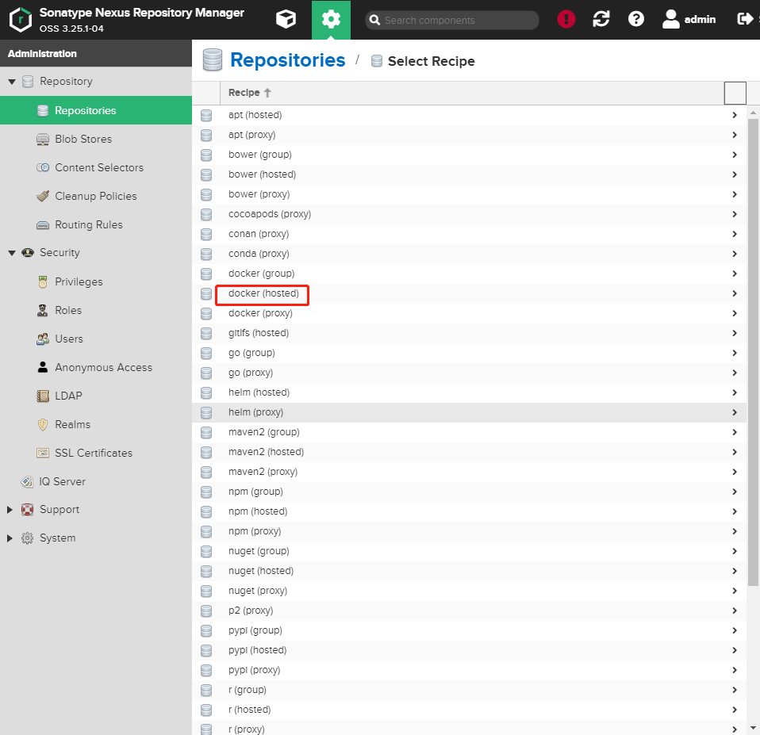

# Nexus 制品库的介绍与安装

## Introduction

在前面我们写到，**制品库**是承接 CI 构建后的产出制品的仓库。具有**版本管理**，**历史管理**，**权限校验**等功能。
在这里，我们选用 Nexus3 作为制品库。

### 拉取 Neuxs 镜像

老规矩，先拉取nexus镜像。命令不多解释：
```sbash
docker pull sonatype/nexus3
```

### 启动 Nexus 容器

在 /home 下面新建一个名为 nexus 的文件夹，方便我们存放 Nexus 相关数据。并赋予权限

```bash
mkdir /home/nexus && chown -R 200 /home/nexus
```

然后启动容器。

```bash
docker run -d -p 8081:8081 -p 8082:8082 \
--name nexus \
-v /home/nexus:/nexus-data \
--restart always \
sonatype/nexus3
```

> Nexus 的主服务端口是 8081，但 Nexus Docker 制品库还需要分配一个新的端口作为服务端口。
这里没有演示分配哪个端口，想分配自己加 -p 参数即可。在这里我使用 8082 作为 docker 服务端口

将8081，8082端口添加到防火墙规则内：

```bash
firewall-cmd --zone=public --add-port=8081/tcp --permanent
firewall-cmd --zone=public --add-port=8082/tcp --permanent
```

### 访问 Nexus

打开浏览器地址栏，访问 Nexus 的服务地址。启动时间比较长，需要耐心等待。可以使用 docker logs 命令查看启动日志。如果显示以下文字，代表启动成功。





## Errors

* docker login 192.168.1.42:8082 报错 401
    

    解决：
    


## Tip

* chown 指令语法
    chown 用来更改某个目录或文件的用户名和用户组

    ```bash
    chown [-cfhvR] [--help] [--version] user[:group] file...
    ```

    参数：

    * user : 新的文件拥有者的使用者 ID
    * group : 新的文件拥有者的使用者组(group)
    * -c : 显示更改的部分的信息
    * -f : 忽略错误信息
    * -h :修复符号链接
    * -v : 显示详细的处理信息
    * -R : 处理指定目录以及其子目录下的所有文件
    * --help : 显示辅助说明
    * --version : 显示版本
    * r 4 可读
    * w 2 可写
    * x 1 可执行
